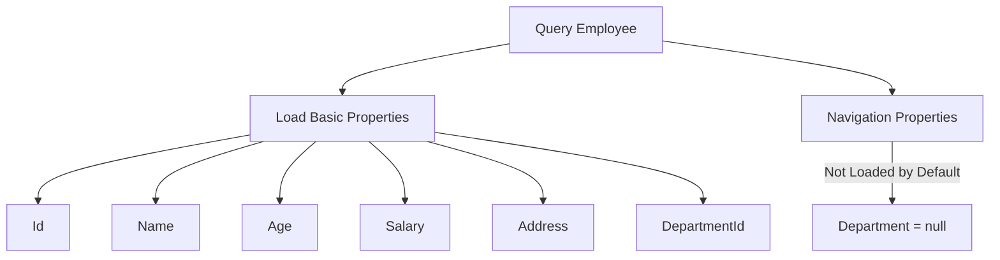
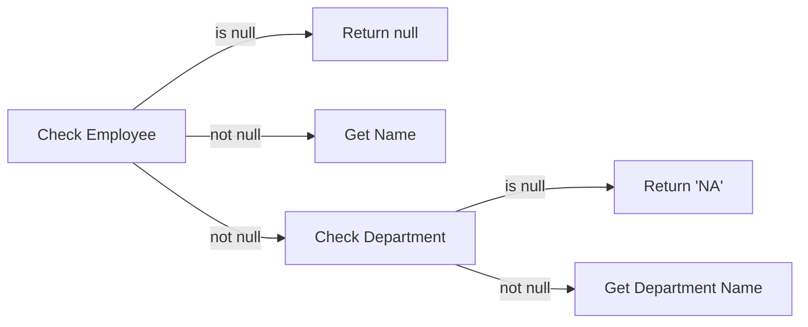
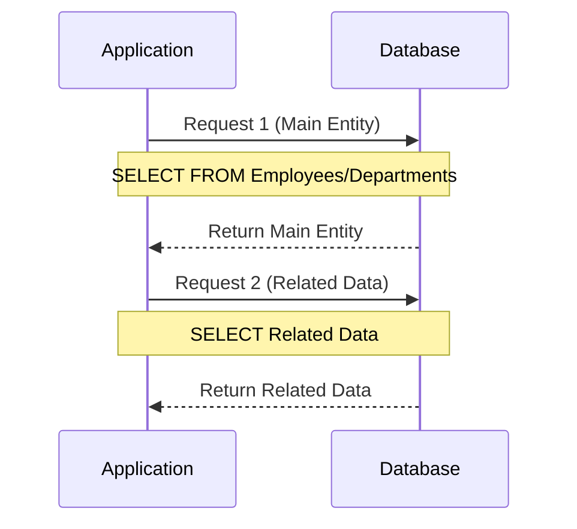
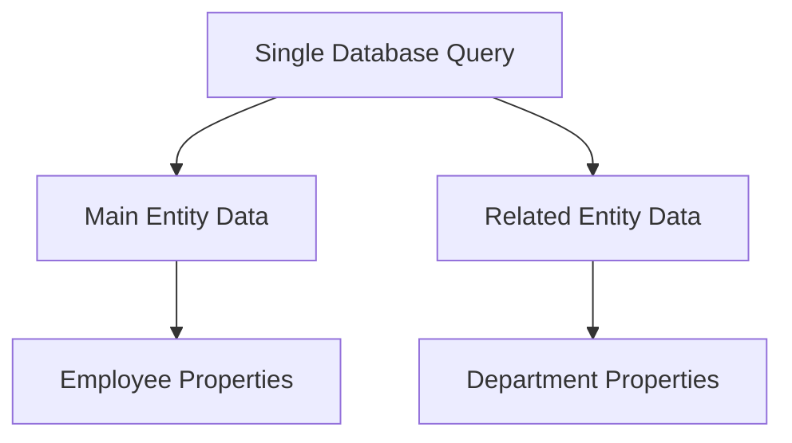
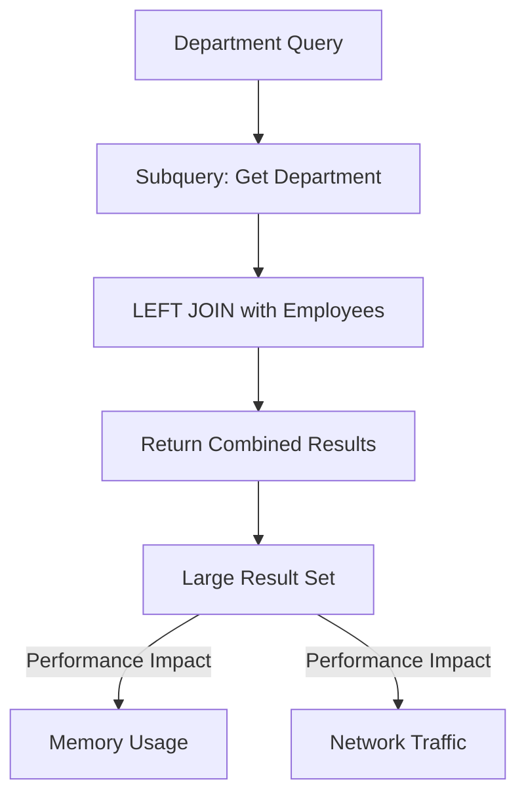
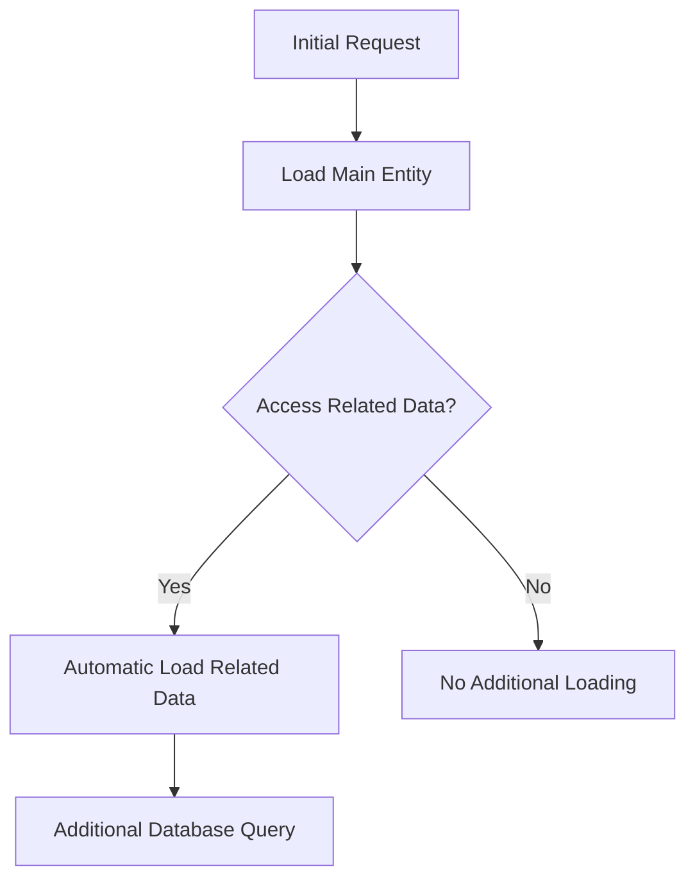
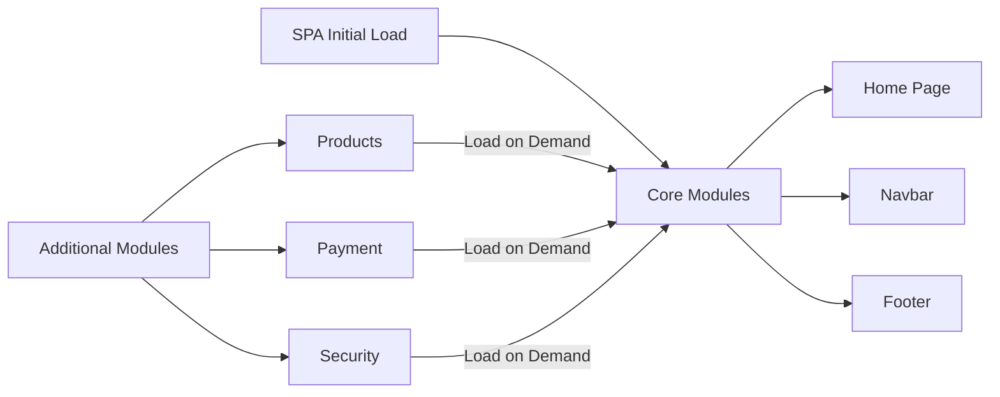

# Entity Framework Core Loading Patterns

## Table of Contents
- [Introduction](#introduction)
- [Default Behavior](#default-behavior)
- [Basic Query Structure](#basic-query-structure)
- [Query Return Types](#query-return-types)
- [Null Propagation](#null-propagation)
- [Types of Loading](#types-of-loading)

## Introduction

When working with Entity Framework Core, understanding how related data is loaded is crucial for building efficient applications. This documentation covers the default behavior, querying patterns, and different loading strategies.

## Default Behavior

When querying an entity with navigation properties:
- Only basic properties are loaded (Id, Name, Age, etc.)
- Navigation properties (related entities) are not loaded by default
- This happens because related data requires additional table queries

Example properties loaded by default for Employee:
- Id
- Name
- Age
- Salary
- Address
- DepartmentId
- Department (navigation property) → NULL



## Basic Query Structure

Here's how to query an employee using LINQ:

```csharp
using AppDbContext dbContext = new AppDbContext();

var employee = from E in dbContext.Employees
               where E.Id == 1
               select E;
```

## Query Return Types

### IQueryable vs IEnumerable

```csharp
// This returns IQueryable, not IEnumerable
var employee = from E in dbContext.Employees
               where E.Id == 1
               select E;
```

Important distinctions:
- Returns `IQueryable` instead of `IEnumerable`
- `IQueryable`: Filtering occurs in database
- `IEnumerable`: Would retrieve all records then filter in memory
- Use `SingleOrDefault()` to ensure single record return

| Return Type | Filter Location | Performance Impact |
|------------|-----------------|-------------------|
| IQueryable | Database | Better - Only matching records transferred |
| IEnumerable | Memory | Worse - All records transferred first |

## Null Propagation

When accessing navigation properties, proper null checking is important:

```csharp
Console.WriteLine($"Employee: {employee?.Name}, Department:{employee?.Department?.Name ?? "NA"}");
```

Null propagation breakdown:
1. `employee?` - Check if employee exists
2. `Department?` - Check if Department is loaded
3. `?? "NA"` - Provide default value if null



## Loading Strategies Overview

There are three ways to load related data:
1. Explicit Loading
2. Eager Loading
3. Lazy Loading

Each strategy has its use cases and performance implications.

| Strategy | When to Load | Best For |
|----------|-------------|-----------|
| Explicit Loading | On demand after main query | Optional related data |
| Eager Loading | With main query | Known required related data |
| Lazy Loading | When accessed | Uncertain data needs |

---


# Entity Framework Core Loading Patterns

## Table of Contents
- [Default Behavior Review](#default-behavior-review)
- [Explicit Loading](#explicit-loading)
  - [Single Reference Loading](#single-reference-loading)
  - [Collection Loading](#collection-loading)
  - [Generated SQL Queries](#generated-sql-queries)
  - [Pros and Cons](#pros-and-cons)

## Default Behavior Review

When querying entities, EF Core generates simple SELECT statements without JOINs:

```sql
-- For Employee query
SELECT TOP(1) [e].[Id], [e].[Address], [e].[Age], [e].[DepartmentId], [e].[Name], [e].[Salary]
FROM [Employees] AS [e]
WHERE [e].[Id] = 1

-- For Department query
SELECT TOP(1) [d].[Id], [d].[DateOfCreation], [d].[Name]
FROM [Departments] AS [d]
WHERE [d].[Id] = 10
```

```csharp
var employee = (from E in dbContext.Employees
                where E.Id == 1
                select E).FirstOrDefault();

// Department navigation property will be null
Console.WriteLine($"Employee: {employee?.Name}, Department:{employee?.Department?.Name ?? "NA"}");
```

## Explicit Loading

Explicit loading allows you to load related data on demand after loading the main entity.

### Single Reference Loading

Loading a single reference (Employee → Department):

```csharp
// First load employee
var employee = (from E in dbContext.Employees
                where E.Id == 1
                select E).FirstOrDefault();

// Explicitly load department - Two syntax options
dbContext.Entry(employee).Reference(E => E.Department).Load();
// OR
dbContext.Entry(employee).Reference(nameof(Employee.Department)).Load();

// Now department data is available
Console.WriteLine($"Employee: {employee?.Name}, Department: {employee?.Department?.Name ?? "NA"}");
```

### Collection Loading

Loading a collection (Department → Employees):

```csharp
// First load department
var department = (from D in dbContext.Departments
                 where D.Id == 10
                 select D).FirstOrDefault();

Console.WriteLine($"Department: Id = {department?.Id}, Name = {department?.Name}");

// Explicitly load employees collection
dbContext.Entry(department).Collection(D => D.Employees).Load();

// Now we can iterate through employees
foreach(var emp in department.Employees)
{
    Console.WriteLine($"Employee: Id = {emp.Id}, Name = {emp?.Name}");
}
```

### Generated SQL Queries



For employee with department:
```sql
-- First Request
SELECT TOP(1) [e].[Id], [e].[Address], [e].[Age], [e].[DepartmentId], [e].[Name], [e].[Salary]
FROM [Employees] AS [e]
WHERE [e].[Id] = 1

-- Second Request (after explicit load)
SELECT [d].[Id], [d].[DateOfCreation], [d].[Name]
FROM [Departments] AS [d]
WHERE [d].[Id] = @DepartmentId
```

### Pros and Cons

| Aspect | Description |
|--------|-------------|
| Pros | - Load data only when needed<br>- Better memory usage for unused relations<br>- Fine-grained control over loading |
| Cons | - Multiple database roundtrips<br>- Need to explicitly request each related entity<br>- Can lead to N+1 query problem if not careful |

### Best Use Cases
1. When related data is optional
2. When you need fine-grained control over loading
3. When you want to reduce initial query complexity
4. When memory optimization is important

### Performance Considerations
- Each `.Load()` call generates a separate database query
- Consider using eager loading if you know you'll need the related data
- Be careful with loops that load related data (N+1 query problem)

---


# Entity Framework Core Loading Patterns - Eager Loading

## Table of Contents
- [Introduction to Eager Loading](#introduction-to-eager-loading)
- [Implementation](#implementation)
- [Generated SQL](#generated-sql)
- [Multiple Related Entities](#multiple-related-entities)
- [Pros and Cons](#pros-and-cons)
- [Advanced Scenarios](#advanced-scenarios)

## Introduction to Eager Loading

Eager loading is a pattern where related data is loaded along with the main entity in the same database query. This is achieved using the `Include` method, which generates a JOIN in the resulting SQL query.



## Implementation

Basic eager loading syntax:

```csharp
var employee = (from E in dbContext.Employees
                        .Include(E => E.Department)
               where E.Id == 1
               select E).FirstOrDefault();

Console.WriteLine($"Employee: {employee?.Name}, Department: {employee?.Department?.Name ?? "NA"}");
```

Generated SQL:
```sql
SELECT TOP(1) [e].[Id], [e].[Address], [e].[Age], [e].[DepartmentId], 
              [e].[Name], [e].[Salary], [d].[Id], [d].[Name]
FROM [Employees] AS [e]
LEFT JOIN [Departments] AS [d] ON [e].[DepartmentId] = [d].[Id]
WHERE [e].[Id] = 1
```

## Multiple Related Entities

You can chain multiple includes for nested relationships:

```csharp
var employee = dbContext.Employees
    .Include(E => E.Department)
    .Include(E => E.Project)
    .FirstOrDefault(e => e.Id == 1);
```

For nested related data, use ThenInclude:
```csharp
dbContext.Employees
    .Include(e => e.Department)
    .ThenInclude(d => d.Test)
```

## Pros and Cons

| Aspect | Description |
|--------|-------------|
| Pros | - Single database query<br>- Reduces round trips to database<br>- Simpler code than explicit loading |
| Cons | - Always loads related data<br>- Can retrieve unnecessary data<br>- May impact memory usage<br>- Less granular control |

## Advanced Scenarios

### Specification Pattern Integration

Eager loading works well with the Specification pattern for dynamic query building:

```csharp
public class Specification<T>
{
    private List<Expression<Func<T, object>>> includes = new();
    
    public void AddInclude(Expression<Func<T, object>> includeExpression)
    {
        includes.Add(includeExpression);
    }
    
    public IQueryable<T> ApplyIncludes(IQueryable<T> query)
    {
        return includes.Aggregate(query, (current, include) => 
            current.Include(include));
    }
}
```

### Best Practices

1. **Consider Usage Patterns**
   - Use eager loading when you know you'll need the related data
   - Avoid when related data is only occasionally needed

2. **Performance Optimization**
   - Be mindful of the amount of data being loaded
   - Consider projection (SELECT) when you need only specific properties

3. **Query Design**
   ```csharp
   // Good: When you always need department data
   public Employee GetEmployeeWithDepartment(int id)
   {
       return dbContext.Employees
           .Include(e => e.Department)
           .FirstOrDefault(e => e.Id == id);
   }

   // Good: When department data is optional
   public Employee GetEmployee(int id, bool includeDepartment = false)
   {
       var query = dbContext.Employees.AsQueryable();
       if (includeDepartment)
           query = query.Include(e => e.Department);
       return query.FirstOrDefault(e => e.Id == id);
   }
   ```

## Key Points
- Eager loading loads related data in a single query
- Uses LEFT JOIN to include related entities
- Suitable for predictable data access patterns
- Can be chained for multiple relationships
- Works well with specification pattern for dynamic queries

---


# Entity Framework Core - Eager Loading Collections

## Table of Contents
- [Collection Eager Loading](#collection-eager-loading)
- [Generated SQL Analysis](#generated-sql-analysis)
- [Performance Implications](#performance-implications)
- [Best Practices](#best-practices)

## Collection Eager Loading

Loading a department with its collection of employees:

```csharp
var department = (from D in dbContext.Departments
                         .Include(D => D.Employees)
                 where D.Id == 10
                 select D).FirstOrDefault();

Console.WriteLine($"Department: Id = {department?.Id}, Name = {department?.Name}");

foreach(var emp in department.Employees)
{
    Console.WriteLine($"Employee: Id = {emp?.Id}, Name = {emp?.Name}");
}
```

## Generated SQL Analysis

```sql
SELECT [t].[Id], [t].[DateOfCreation], [t].[Name], [e].[Id], [e].[Address], 
       [e].[Age], [e].[DepartmentId], [e].[Name]
FROM (
    SELECT TOP(1) [d].[Id], [d].[DateOfCreation], [d].[Name]
    FROM [Departments] AS [d]
    WHERE [d].[Id] = 10
) AS [t]
LEFT JOIN [Employees] AS [e] ON [t].[Id] = [e].[DepartmentId]
ORDER BY [t].[Id]
```



## Performance Implications

### Potential Issues
1. **Unnecessary Data Loading**
   - All employees are loaded even if not needed
   - Memory impact with large employee collections
   - Network bandwidth consumption

2. **Subquery Generation**
   - Generated SQL uses a subquery for department
   - Additional complexity in query execution
   - May impact performance for large datasets

3. **Resource Usage**
   ```mermaid
   graph LR
       A[Query Execution] --> B[Memory Usage]
       A --> C[Network Bandwidth]
       A --> D[Database Load]
       B -->|Impact| E[Application Performance]
       C -->|Impact| E
       D -->|Impact| E
   ```

## Best Practices

### 1. Selective Loading Pattern
```csharp
public Department GetDepartment(int id, bool includeEmployees = false)
{
    var query = dbContext.Departments.AsQueryable();
    
    if (includeEmployees)
    {
        query = query.Include(d => d.Employees);
    }
    
    return query.FirstOrDefault(d => d.Id == id);
}
```

### 2. Data Transfer Objects (DTOs)
```csharp
public class DepartmentBasicDTO
{
    public int Id { get; set; }
    public string Name { get; set; }
    public DateTime DateOfCreation { get; set; }
}

public class DepartmentWithEmployeesDTO : DepartmentBasicDTO
{
    public ICollection<EmployeeDTO> Employees { get; set; }
}
```

### 3. Projection for Specific Needs
```csharp
var departmentInfo = dbContext.Departments
    .Where(d => d.Id == 10)
    .Select(d => new DepartmentBasicDTO
    {
        Id = d.Id,
        Name = d.Name,
        DateOfCreation = d.DateOfCreation
    })
    .FirstOrDefault();
```

## Recommendations

1. **Consider Data Volume**
   - Evaluate number of related records
   - Assess memory requirements
   - Monitor network impact

2. **Query Design**
   - Use selective loading when possible
   - Implement DTOs for specific use cases
   - Consider projections for large datasets

3. **Performance Optimization**
   - Monitor query execution plans
   - Use filtering before Including
   - Consider pagination for large collections

## Code Examples

### Bad Practice
```csharp
// Always loading employees regardless of need
public Department GetDepartmentInfo(int id)
{
    return dbContext.Departments
        .Include(d => d.Employees)
        .FirstOrDefault(d => d.Id == id);
}
```

### Good Practice
```csharp
// Flexible loading based on needs
public Department GetDepartmentInfo(int id, bool includeEmployees = false)
{
    var query = dbContext.Departments.AsQueryable();
    
    if (includeEmployees)
    {
        query = query.Include(d => d.Employees);
    }
    
    return query.FirstOrDefault(d => d.Id == id);
}
```

---
# Entity Framework Core - Lazy Loading

## Table of Contents
- [Introduction](#introduction)
- [Lazy Loading Concept](#lazy-loading-concept)
- [Implementation](#implementation)
- [Comparison with Other Patterns](#comparison-with-other-patterns)
- [Real-World Example: SPA Architecture](#real-world-example-spa-architecture)
- [Configuration and Setup](#configuration-and-setup)

## Introduction

Lazy loading is a design pattern where the loading of related data is deferred until it's actually needed. It's part of a broader software engineering concept used in various contexts, from database access to web applications.

## Lazy Loading Concept



### Core Principles
1. Load data only when needed
2. Implicit loading (automatic)
3. On-demand database queries
4. Multiple database roundtrips

## Implementation

### 1. Package Installation
```xml
<PackageReference Include="Microsoft.EntityFrameworkCore.Proxies" Version="6.0.0" />
```

### 2. DbContext Configuration
```csharp
protected override void OnConfiguring(DbContextOptionsBuilder optionsBuilder)
{
    optionsBuilder
        .UseLazyLoadingProxies()
        .UseSqlServer("your_connection_string");
}
```

### 3. Model Requirements
```csharp
public class Employee
{
    public int Id { get; set; }
    public string Name { get; set; }
    // Must be virtual for lazy loading
    public virtual Department Department { get; set; }
}

public class Department
{
    public int Id { get; set; }
    public string Name { get; set; }
    // Must be virtual for lazy loading
    public virtual ICollection<Employee> Employees { get; set; }
}
```

### Usage Example
```csharp
// No explicit loading required
var employee = (from E in dbContext.Employees
               where E.Id == 1
               select E).FirstOrDefault();

// Department loads automatically when accessed
Console.WriteLine($"Employee: {employee?.Name}, Department: {employee?.Department?.Name}");

var department = (from D in dbContext.Departments
                 where D.Id == 10
                 select D).FirstOrDefault();

// Employees load automatically when accessed
foreach(var emp in department.Employees)
{
    Console.WriteLine($"Employee: Id = {emp.Id}, Name = {emp.Name}");
}
```

## Comparison with Other Patterns

| Feature | Lazy Loading | Explicit Loading | Eager Loading |
|---------|--------------|------------------|---------------|
| Loading Time | On demand | On demand | Immediate |
| Control | Implicit | Explicit | Explicit |
| Code Complexity | Low | Medium | Low |
| Performance Impact | Multiple queries | Multiple queries | Single query |
| Memory Usage | Initially low | Initially low | Initially high |
| Database Trips | Multiple | Multiple | Single |
| Best Use Case | Unknown needs | Controlled loading | Known needs |

## Real-World Example: SPA Architecture

Similar to how modern SPAs work:



### Parallels with EF Core Lazy Loading
1. Initial load contains essential data
2. Additional data loaded on demand
3. Reduces initial load time
4. Optimizes resource usage

## Configuration and Setup

### Required Steps
1. Install Proxies Package
2. Configure DbContext
3. Make entities public
4. Make navigation properties virtual

### Best Practices
1. **Mixed Approach**
   ```csharp
   // Enable lazy loading globally
   optionsBuilder.UseLazyLoadingProxies();
   
   // Use eager loading when needed
   var query = dbContext.Employees.Include(e => e.Department);
   ```

2. **Performance Considerations**
   - Monitor query execution
   - Watch for N+1 query problems
   - Use eager loading for known relationships

3. **Memory Management**
   ```csharp
   using (var context = new AppDbContext())
   {
       var employee = context.Employees.Find(1);
       // Access related data within context lifecycle
   }
   ```

## Trade-offs

### Advantages
- Flexible loading
- Reduced initial load
- Automatic loading
- Simple to use

### Disadvantages
- Multiple database trips
- Potential performance impact
- Less explicit control
- Proxy overhead

## Recommendations

1. **Enable Both Patterns**
   ```csharp
   // Enable lazy loading globally
   optionsBuilder.UseLazyLoadingProxies();
   
   // Use selective eager loading when appropriate
   public Employee GetEmployeeWithDepartment(int id)
   {
       return context.Employees
           .Include(e => e.Department)
           .FirstOrDefault(e => e.Id == id);
   }
   ```

2. **Monitor Performance**
   - Track database queries
   - Watch for unexpected loads
   - Profile application performance

---

