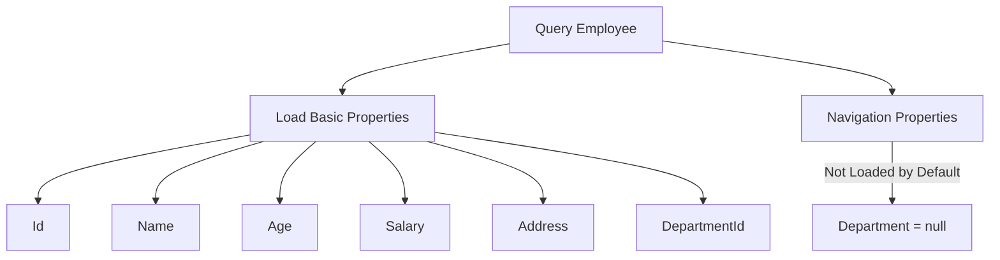
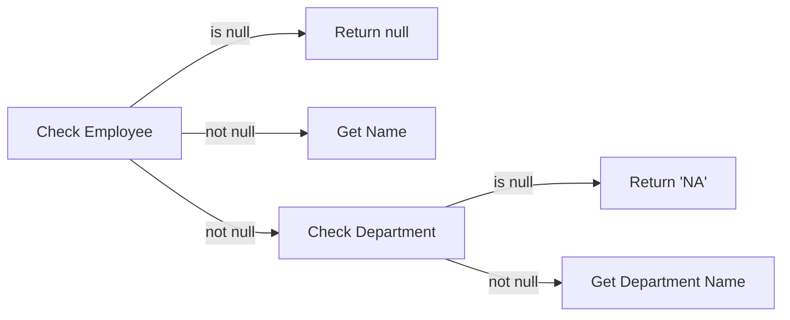

# Entity Framework Core Loading Patterns

## Table of Contents
- [Introduction](#introduction)
- [Default Behavior](#default-behavior)
- [Basic Query Structure](#basic-query-structure)
- [Query Return Types](#query-return-types)
- [Null Propagation](#null-propagation)
- [Types of Loading](#types-of-loading)

## Introduction

When working with Entity Framework Core, understanding how related data is loaded is crucial for building efficient applications. This documentation covers the default behavior, querying patterns, and different loading strategies.

## Default Behavior

When querying an entity with navigation properties:
- Only basic properties are loaded (Id, Name, Age, etc.)
- Navigation properties (related entities) are not loaded by default
- This happens because related data requires additional table queries

Example properties loaded by default for Employee:
- Id
- Name
- Age
- Salary
- Address
- DepartmentId
- Department (navigation property) → NULL



## Basic Query Structure

Here's how to query an employee using LINQ:

```csharp
using AppDbContext dbContext = new AppDbContext();

var employee = from E in dbContext.Employees
               where E.Id == 1
               select E;
```

## Query Return Types

### IQueryable vs IEnumerable

```csharp
// This returns IQueryable, not IEnumerable
var employee = from E in dbContext.Employees
               where E.Id == 1
               select E;
```

Important distinctions:
- Returns `IQueryable` instead of `IEnumerable`
- `IQueryable`: Filtering occurs in database
- `IEnumerable`: Would retrieve all records then filter in memory
- Use `SingleOrDefault()` to ensure single record return

| Return Type | Filter Location | Performance Impact |
|------------|-----------------|-------------------|
| IQueryable | Database | Better - Only matching records transferred |
| IEnumerable | Memory | Worse - All records transferred first |

## Null Propagation

When accessing navigation properties, proper null checking is important:

```csharp
Console.WriteLine($"Employee: {employee?.Name}, Department:{employee?.Department?.Name ?? "NA"}");
```

Null propagation breakdown:
1. `employee?` - Check if employee exists
2. `Department?` - Check if Department is loaded
3. `?? "NA"` - Provide default value if null



## Loading Strategies Overview

There are three ways to load related data:
1. Explicit Loading
2. Eager Loading
3. Lazy Loading

Each strategy has its use cases and performance implications.

| Strategy | When to Load | Best For |
|----------|-------------|-----------|
| Explicit Loading | On demand after main query | Optional related data |
| Eager Loading | With main query | Known required related data |
| Lazy Loading | When accessed | Uncertain data needs |

---
*More sections will be added for each loading strategy with detailed examples.*
