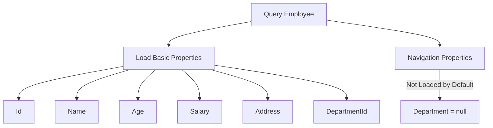
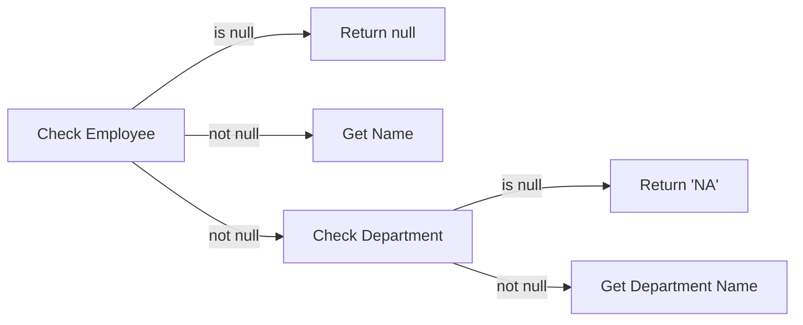
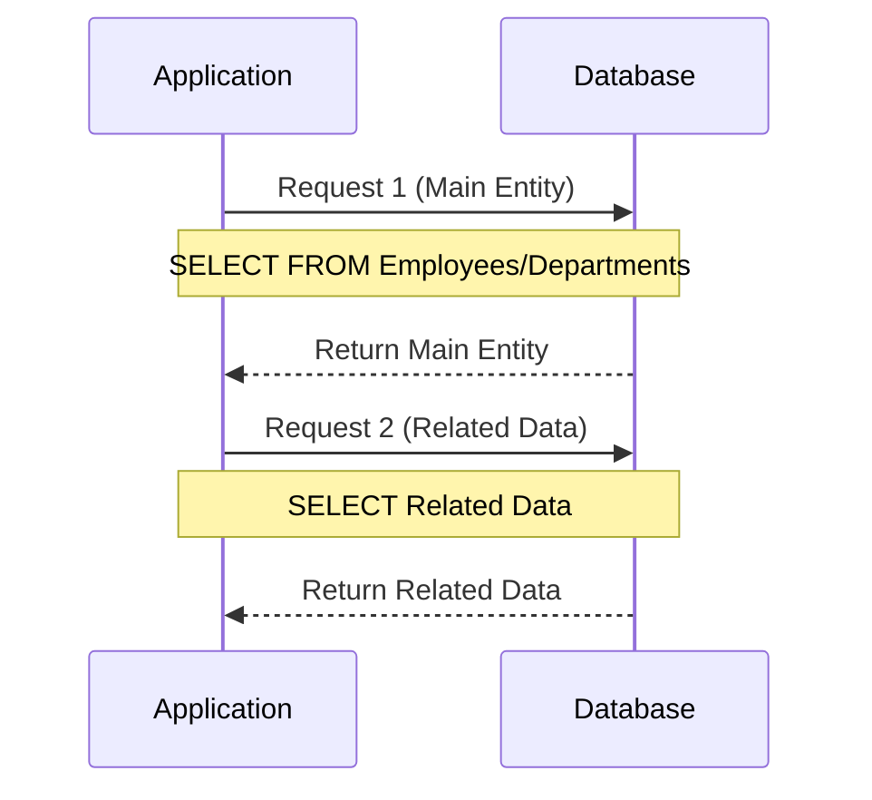

# Entity Framework Core Loading Patterns

## Table of Contents
- [Introduction](#introduction)
- [Default Behavior](#default-behavior)
- [Basic Query Structure](#basic-query-structure)
- [Query Return Types](#query-return-types)
- [Null Propagation](#null-propagation)
- [Types of Loading](#types-of-loading)

## Introduction

When working with Entity Framework Core, understanding how related data is loaded is crucial for building efficient applications. This documentation covers the default behavior, querying patterns, and different loading strategies.

## Default Behavior

When querying an entity with navigation properties:
- Only basic properties are loaded (Id, Name, Age, etc.)
- Navigation properties (related entities) are not loaded by default
- This happens because related data requires additional table queries

Example properties loaded by default for Employee:
- Id
- Name
- Age
- Salary
- Address
- DepartmentId
- Department (navigation property) → NULL



## Basic Query Structure

Here's how to query an employee using LINQ:

```csharp
using AppDbContext dbContext = new AppDbContext();

var employee = from E in dbContext.Employees
               where E.Id == 1
               select E;
```

## Query Return Types

### IQueryable vs IEnumerable

```csharp
// This returns IQueryable, not IEnumerable
var employee = from E in dbContext.Employees
               where E.Id == 1
               select E;
```

Important distinctions:
- Returns `IQueryable` instead of `IEnumerable`
- `IQueryable`: Filtering occurs in database
- `IEnumerable`: Would retrieve all records then filter in memory
- Use `SingleOrDefault()` to ensure single record return

| Return Type | Filter Location | Performance Impact |
|------------|-----------------|-------------------|
| IQueryable | Database | Better - Only matching records transferred |
| IEnumerable | Memory | Worse - All records transferred first |

## Null Propagation

When accessing navigation properties, proper null checking is important:

```csharp
Console.WriteLine($"Employee: {employee?.Name}, Department:{employee?.Department?.Name ?? "NA"}");
```

Null propagation breakdown:
1. `employee?` - Check if employee exists
2. `Department?` - Check if Department is loaded
3. `?? "NA"` - Provide default value if null



## Loading Strategies Overview

There are three ways to load related data:
1. Explicit Loading
2. Eager Loading
3. Lazy Loading

Each strategy has its use cases and performance implications.

| Strategy | When to Load | Best For |
|----------|-------------|-----------|
| Explicit Loading | On demand after main query | Optional related data |
| Eager Loading | With main query | Known required related data |
| Lazy Loading | When accessed | Uncertain data needs |

---


# Entity Framework Core Loading Patterns

## Table of Contents
- [Default Behavior Review](#default-behavior-review)
- [Explicit Loading](#explicit-loading)
  - [Single Reference Loading](#single-reference-loading)
  - [Collection Loading](#collection-loading)
  - [Generated SQL Queries](#generated-sql-queries)
  - [Pros and Cons](#pros-and-cons)

## Default Behavior Review

When querying entities, EF Core generates simple SELECT statements without JOINs:

```sql
-- For Employee query
SELECT TOP(1) [e].[Id], [e].[Address], [e].[Age], [e].[DepartmentId], [e].[Name], [e].[Salary]
FROM [Employees] AS [e]
WHERE [e].[Id] = 1

-- For Department query
SELECT TOP(1) [d].[Id], [d].[DateOfCreation], [d].[Name]
FROM [Departments] AS [d]
WHERE [d].[Id] = 10
```

```csharp
var employee = (from E in dbContext.Employees
                where E.Id == 1
                select E).FirstOrDefault();

// Department navigation property will be null
Console.WriteLine($"Employee: {employee?.Name}, Department:{employee?.Department?.Name ?? "NA"}");
```

## Explicit Loading

Explicit loading allows you to load related data on demand after loading the main entity.

### Single Reference Loading

Loading a single reference (Employee → Department):

```csharp
// First load employee
var employee = (from E in dbContext.Employees
                where E.Id == 1
                select E).FirstOrDefault();

// Explicitly load department - Two syntax options
dbContext.Entry(employee).Reference(E => E.Department).Load();
// OR
dbContext.Entry(employee).Reference(nameof(Employee.Department)).Load();

// Now department data is available
Console.WriteLine($"Employee: {employee?.Name}, Department: {employee?.Department?.Name ?? "NA"}");
```

### Collection Loading

Loading a collection (Department → Employees):

```csharp
// First load department
var department = (from D in dbContext.Departments
                 where D.Id == 10
                 select D).FirstOrDefault();

Console.WriteLine($"Department: Id = {department?.Id}, Name = {department?.Name}");

// Explicitly load employees collection
dbContext.Entry(department).Collection(D => D.Employees).Load();

// Now we can iterate through employees
foreach(var emp in department.Employees)
{
    Console.WriteLine($"Employee: Id = {emp.Id}, Name = {emp?.Name}");
}
```

### Generated SQL Queries



For employee with department:
```sql
-- First Request
SELECT TOP(1) [e].[Id], [e].[Address], [e].[Age], [e].[DepartmentId], [e].[Name], [e].[Salary]
FROM [Employees] AS [e]
WHERE [e].[Id] = 1

-- Second Request (after explicit load)
SELECT [d].[Id], [d].[DateOfCreation], [d].[Name]
FROM [Departments] AS [d]
WHERE [d].[Id] = @DepartmentId
```

### Pros and Cons

| Aspect | Description |
|--------|-------------|
| Pros | - Load data only when needed<br>- Better memory usage for unused relations<br>- Fine-grained control over loading |
| Cons | - Multiple database roundtrips<br>- Need to explicitly request each related entity<br>- Can lead to N+1 query problem if not careful |

### Best Use Cases
1. When related data is optional
2. When you need fine-grained control over loading
3. When you want to reduce initial query complexity
4. When memory optimization is important

### Performance Considerations
- Each `.Load()` call generates a separate database query
- Consider using eager loading if you know you'll need the related data
- Be careful with loops that load related data (N+1 query problem)

---
*Next section will cover Eager Loading patterns and their implementation.*
